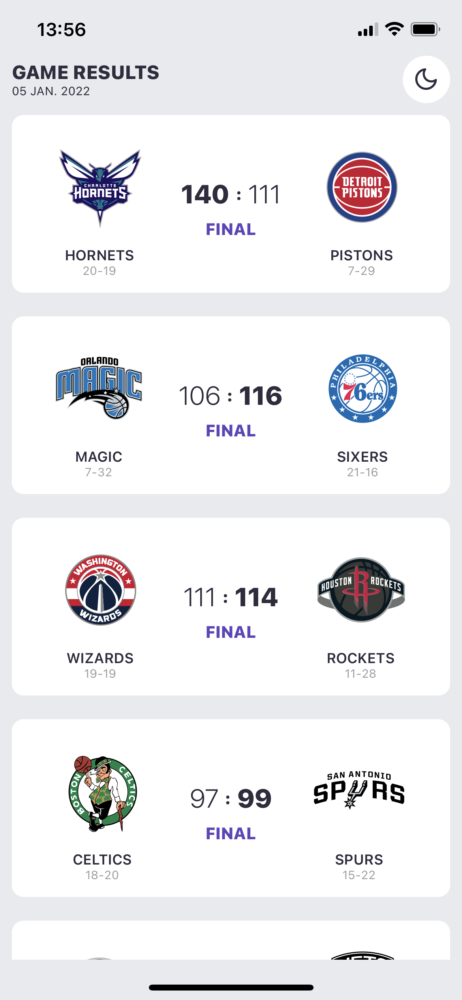
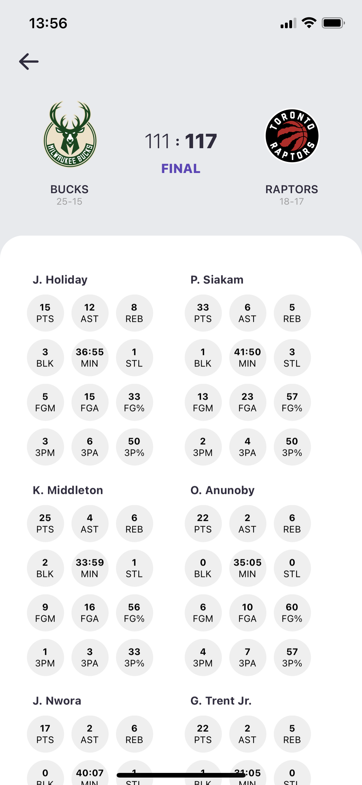

# NBA APP 📱

- Mobile application written with React Native on Expo.
- Using React Native Animatable & Stylesheet in JS.
- Running with NBA App Backend API

### Try the demo on 

  
  

## Authors

- [tphilippini](https://www.tphilippini.fr)

## License

This project is open source and available under the [MIT License](LICENSE).
